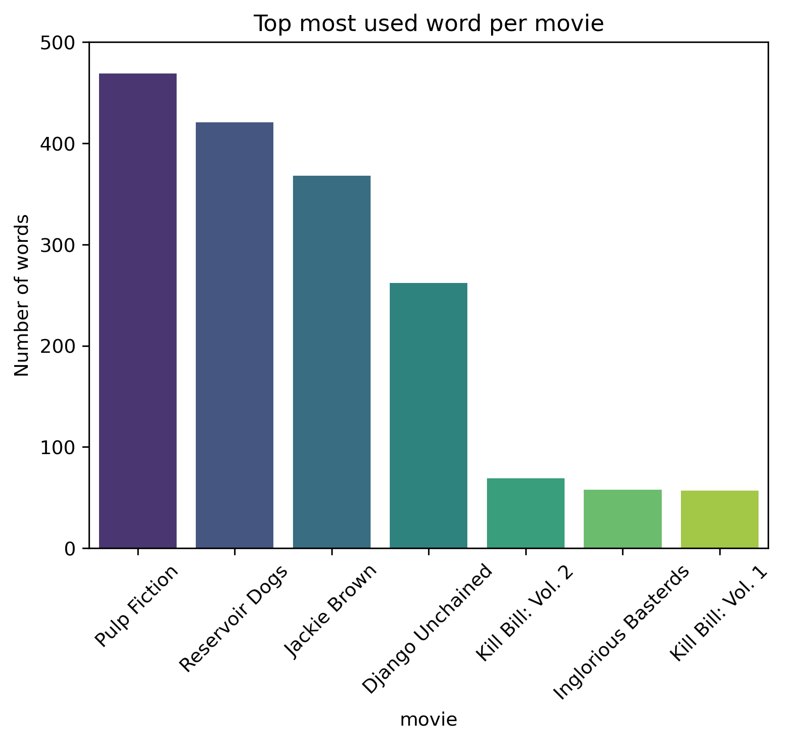
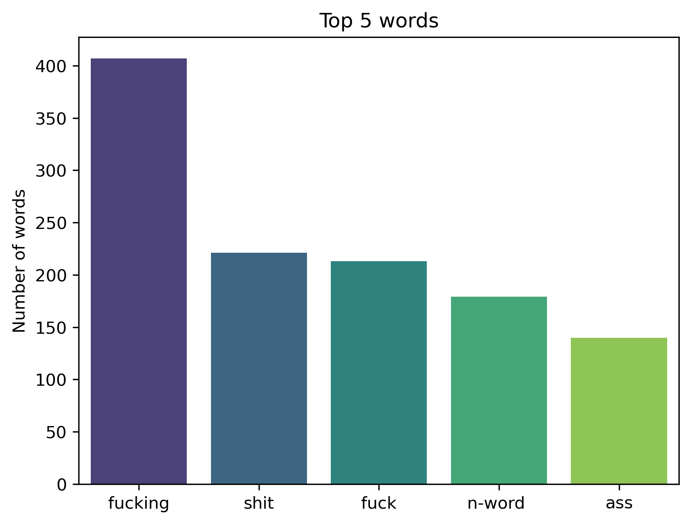
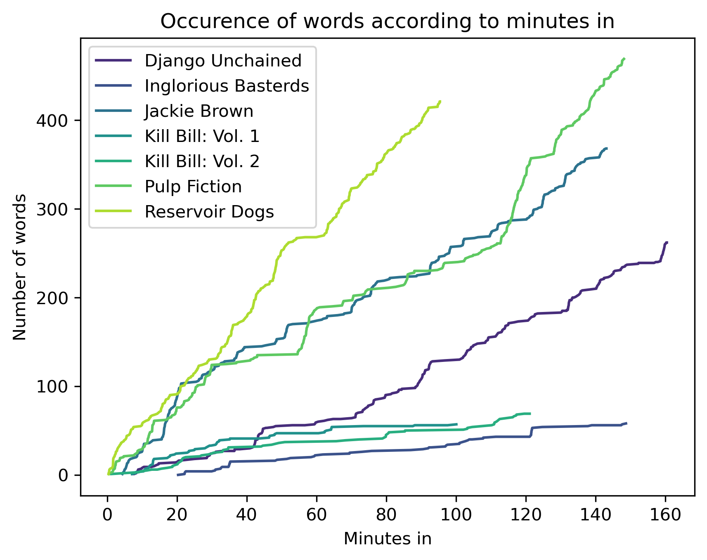

# Project of Data Visualization (COM-480)

| Student's name | SCIPER |
| -------------- | ------ |
| Daniel Demko   | 296925 |
| Louca Gerussi  | 295908 |

[Milestone 1](#milestone-1) • [Milestone 2](#milestone-2) • [Milestone 3](#milestone-3)

## Milestone 1 (7th April, 5pm) <a name="milestone-1"></a>

**10% of the final grade**

This is a preliminary milestone to let you set up goals for your final project and assess the feasibility of your ideas.
Please, fill the following sections about your project.

*(max. 2000 characters per section)*

### Dataset

For this project, we have chosen to explore FiveThirtyEight’s "Tarantino movies swears & deaths" dataset, which contains information about the number and type of swear words used in Quentin Tarantino's movies, the death of characters, each linked to a timestamp.

| Column | Description |
| -------------- | ------ |
| `movie` | Movie title |
| `type` | Whether the event was a profane word or a death (by keyword “death” or “word”) |
| `word` | The specific profane word, if the event was a word |
| `minutes_in` | The number of minutes into the film the event occurred |

To assess the quality of the data, we will need to analyze its completeness, consistency, and accuracy. 

The dataset cuts off at year 2015, so movies Tarantino produced after these dates will not be present in the dataset. Notably “Hateful Eight”, which could be an interesting addition if we want a greater variety of eras of time depicted by the movies. We will see if it is worth expanding the dataset. To do so, we've built and provided a tool to easily log the swear words and deaths while watching a movie (can be found in `/sim-tarantino`, a browser based mini-project which can by run with python). 

The dataset itself is clean and easily exploitable and should not pose any problem. 

Moreover, we will assume that the dataset is correct and the entries in the tables are accurate to the movies.


### Problematic

The general topic of our visualization is **exploring/visualizing** the use of swear words in Tarantino's movies, rather than demonstrating a specific question. 

As [FiveThirtyEight points it out](https://fivethirtyeight.com/features/complete-catalog-curses-deaths-quentin-tarantino-films/), since his first feature, Quentin Tarantino has sparked both fascination and criticism from reviewers for his movies' explicit language and frequent portrayal of violence.

Our project aims to delve deeper into this aspect of Tarantino's filmmaking by visualizing the frequencies of different types of swear words used in each of his movies. By doing so, we hope to provide insights into Tarantino's unique style and appeal to film enthusiasts and fans of his work.

We are considering exploring multiple axis in this project:
- The type of swear words (ethnical, gender oriented, mild, etc) to possibly classify the movies
- Is there a link of swear frequency with on screen death
- How swears are distributed within the movie, can we observe a specific pattern
- Can we recognize specific swear patterns or swear combinations (swear streaks)
- Are swears count directly correlated with the movie rating (taken from imdb dataset)

After having conducted a better data analysis, we will select some of those aspects and represent them in a visually appealing way. We are thinking of having two different view modes. One would be “safe mode”, the default mode, that would allow to see the results and the swears world in a censored way (f\*ck → fork, sh\*t → shoot), another one would be accessible by clicking some button to display the uncensored visuals.


### Exploratory Data Analysis

We did not preprocess the data as it was already clean and ready to be used. We did some basic analysis to get a better understanding of the data and to get some ideas for the visualizations however.

The dataset contains `1894 entries`, of which `190` are for indicating `deaths`, and `1704` are `swear words`.

There are a total of 7 movies: 
```
Django Unchained, Inglorious Basterds, Jackie Brown, Kill Bill: Vol. 1, Kill Bill: Vol. 2, Pulp Fiction, Reservoir Dogs
```

There are a number of 60 different swear words, of which the top 5 words
| Swear word    | Count |
| ------- | ----- |
| f*cking | 407   |
| sh*t    | 221   |
| f*ck    | 213   |
| n-word  | 179   |
| a**     | 140   |

Number of swear words per movie, with the their most used swear word and the percentage of total swear words used in the movie

| Movie               | Swear words | Most used swear word | % of total swear words |
| ------------------- | ----------- | -------------------- | ---------------------- |
| Pulp Fiction        |   469       |  f*cking (133 times) | 27.5                   |
| Reservoir Dogs      |   421       | f*cking (180 times)  | 24.7                   |
| Jackie Brown        |   368       | sh*t (66 times)      | 21.6                   |
| Django Unchained    |   262       | n-word  (114 times)  | 15.4                   |
| Kill Bill: Vol. 2   |    69       | f*cking (19 times)   | 4.0                    |
| Inglorious Basterds |    58       |  f*ck (11 times)     | 3.4                    |
| Kill Bill: Vol. 1   |    57       | sh*t (8 times)       | 3.3                    |

At last, a couple of basic graphs to get a glimpse of the data:






### Related work

This project has already been done by [FiveThirtyEight](https://fivethirtyeight.com/features/complete-catalog-curses-deaths-quentin-tarantino-films/) themselves, and by a few other data analyst enthusiasts ([here](https://ismayc.github.io/soc301_s2017/group_projects/group4.html), and [here](https://rstudio-pubs-static.s3.amazonaws.com/235553_58fbac0330f0432e9be75dca4df07b6b.html)). 

It is clear that the authors aimed to analyze the data, but we believe that they focused primarily on the facts themselves and ended up investing less effort into exploring and interpreting the data. In other words, the **presentation** of the data lacked the necessary depth and nuance that would make it more compelling and convincing to the audience. 

Therefore, our take on this task would put more emphasis on exploring the data and conveying its significance through more engaging and informative visualizations mainly. By refining the visual elements and adopting a more engaging approach to the data, we are confident that the insights we wish to convey can be communicated with greater clarity and effectiveness, ultimately leading to a more impactful and memorable user experience.

We also plan on adding an extra layer of interactivity, instead of simply presenting static charts and information.

## Milestone 2 (7th May, 5pm)

**10% of the final grade**


## Milestone 3 (4th June, 5pm)

**80% of the final grade**


## Late policy

- < 24h: 80% of the grade for the milestone
- < 48h: 70% of the grade for the milestone

